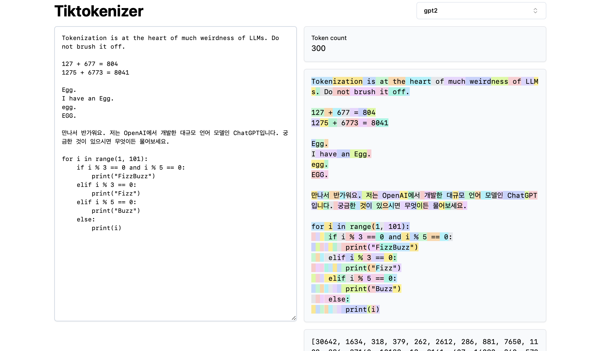

# LLM Tokenization

Hi everyone, today we are going to look at Tokenization in Large Language Models (LLMs). Sadly, tokenization is a relatively complex and gnarly component of the state of the art LLMs, but it is necessary to understand in some detail because a lot of the shortcomings of LLMs that may be attributed to the neural network or otherwise appear mysterious actually trace back to tokenization.

### Previously: character-level tokenization

So what is tokenization? Well it turns out that in our previous video, [Let's build GPT from scratch](https://www.youtube.com/watch?v=kCc8FmEb1nY), we already covered tokenization but it was only a very simple, naive, character-level version of it. When you go to the [Google colab](https://colab.research.google.com/drive/1JMLa53HDuA-i7ZBmqV7ZnA3c_fvtXnx-?usp=sharing) for that video, you'll see that we started with our training data ([Shakespeare](https://raw.githubusercontent.com/karpathy/char-rnn/master/data/tinyshakespeare/input.txt)), which is just a large string in Python:

```
First Citizen: Before we proceed any further, hear me speak.

All: Speak, speak.

First Citizen: You are all resolved rather to die than to famish?

All: Resolved. resolved.

First Citizen: First, you know Caius Marcius is chief enemy to the people.

All: We know't, we know't.
```

But how do we feed strings into a language model? Well, we saw that we did this by first constructing a vocabulary of all the possible characters we found in the entire training set:

```python
# here are all the unique characters that occur in this text
chars = sorted(list(set(text)))
vocab_size = len(chars)
print(''.join(chars))
print(vocab_size)

# !$&',-.3:;?ABCDEFGHIJKLMNOPQRSTUVWXYZabcdefghijklmnopqrstuvwxyz
# 65
```

And then creating a lookup table for converting between individual characters and integers according to the vocabulary above. This lookup table was just a Python dictionary:

```python
stoi = { ch:i for i,ch in enumerate(chars) }
itos = { i:ch for i,ch in enumerate(chars) }
# encoder: take a string, output a list of integers
encode = lambda s: [stoi[c] for c in s]
# decoder: take a list of integers, output a string
decode = lambda l: ''.join([itos[i] for i in l])

print(encode("hii there"))
print(decode(encode("hii there")))

# [46, 47, 47, 1, 58, 46, 43, 56, 43]
# hii there
```

Once we've converted a string into a sequence of integers, we saw that each integer was used as an index into a 2-dimensional embedding of trainable parameters. Because we have a vocabulary size of `vocab_size=65`, this embedding table will also have 65 rows:

```python
class BigramLanguageModel(nn.Module):

def __init__(self, vocab_size):
	super().__init__()
	self.token_embedding_table = nn.Embedding(vocab_size, n_embd)

def forward(self, idx, targets=None):
	tok_emb = self.token_embedding_table(idx) # (B,T,C)
```

Here, the integer "plucks out" a row of this embedding table and this row is the vector that represents this token. This vector then feeds into the Transformer as the input at the corresponding time step.

### "Character chunks" for tokenization using the BPE algorithm

This is all well and good for the naive setting of a character-level language model. But in practice, in state of the art language models, people use a lot more complicated schemes for constructing these token vocabularies. In particular, these schemes work not on a character level, but on character chunk level. And the way these chunk vocabularies are constructed is by using algorithms such as the **Byte Pair Encoding** (BPE) algorithm, which we are going to cover in detail below.

Turning to the historical development of this approach for a moment, the paper that popularized the use of the byte-level BPE algorithm for language model tokenization is the [GPT-2 paper](https://d4mucfpksywv.cloudfront.net/better-language-models/language_models_are_unsupervised_multitask_learners.pdf) from OpenAI in 2019, "Language Models are Unsupervised Multitask Learners". Scroll down to Section 2.2 on "Input Representation" where they describe and motivate this algorithm. At the end of this section you'll see them say:

> *The vocabulary is expanded to 50,257. We also increase the context size from 512 to 1024 tokens and a larger batchsize of 512 is used.*

Recall that in the attention layer of a Transformer, every token is attending to a finite list of tokens previously in the sequence. The paper here says that the GPT-2 model has a context length of 1024 tokens, up from 512 in GPT-1. In other words, tokens are the fundamental "atoms" at the input to the LLM. And tokenization is the process for taking raw strings in Python and converting them to a list of tokens, and vice versa. As another popular example to demonstrate the pervasiveness of this abstraction, if you go to the [Llama 2](https://arxiv.org/abs/2307.09288) paper as well and you search for "token", you're going to get 63 hits. So for example, the paper claims that they trained on 2 trillion tokens, etc.

### Brief taste of the complexities of tokenization

Before we dive into details of the implementation, let's briefly motivate the need to understand the tokenization process in some detail. Tokenization is at the heart of a lot of weirdness in LLMs and I would advise that you do not brush it off. A lot of the issues that may look like issues with the neural network architecture actually trace back to tokenization. Here are just a few examples:

- Why can't LLM spell words? **Tokenization**.
- Why can't LLM do super simple string processing tasks like reversing a string? **Tokenization**.
- Why is LLM worse at non-English languages (e.g. Japanese)? **Tokenization**.
- Why is LLM bad at simple arithmetic? **Tokenization**.
- Why did GPT-2 have more than necessary trouble coding in Python? **Tokenization**.
- Why did my LLM abruptly halt when it sees the string "<|endoftext|>"? **Tokenization**.
- What is this weird warning I get about a "trailing whitespace"? **Tokenization**.
- Why did the LLM break if I ask it about "SolidGoldMagikarp"? **Tokenization**.
- Why should I prefer to use YAML over JSON with LLMs? **Tokenization**.
- Why is LLM not actually end-to-end language modeling? **Tokenization**.
- What is the real root of suffering? **Tokenization**.

We will loop back around to these at the end of the video.

### Visual preview of tokenization

Next, let's load this [tokenization webapp](https://tiktokenizer.vercel.app). What is nice about this webapp is that tokenization is running live in your web browser, allowing you to easily input some text string at the input, and see the tokenization on the right. On the top, you can see that we are currently using the `gpt2` tokenizer, and we see that the string that we pasted in with this example is currently tokenizing into 300 tokens. Here they are shown explicitly in colors:



So for example, the string "Tokenization" encoded into the tokens 30642 followed by the token 1634. The token " is" (note that these is three characters, including the space in the front, this is important!) is index 318. Be careful with whitespace because it is absolutely present in the string and must be tokenized along with all the other characters, but is usually omitted in visualization for clarity. You can toggle on and off its visualization at the bottom of the app. In the same way, the token " at" is 379, " the" is 262, etc.

Next, we have a simple example of some arithmetic. Here, we see that numbers may be inconsistently decomposed by the tokenizer. For example, the number 127 is a single token of three characters, but the number 677 because two tokens: the token " 6" (again, note the space in the front!) and the token "77". We rely on the large language model to make sense of this arbitrariness. It has to learn inside its parameters and during training that these two tokens (" 6" and "77" actually combine to create the number 677). In the same way, we see that if the LLM wanted to predict that the result of this sum is the number 804, it would have to output that in two time steps: first it has to emit the token " 8", and then the token "04". Note that all of these splits look completely arbitrary. In the example right below, we see that 1275 is "12" followed by "75", 6773 is actually two tokens " 6", "773", and 8041 is " 8", "041".

(to be continued...)
(TODO: may continue this unless we figure out how to generate it automatically from the video :))
